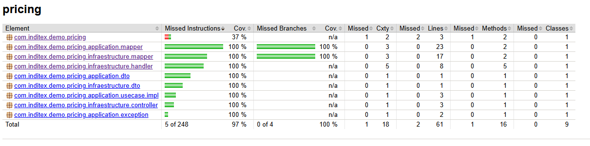

# Inditex Core Platform Technical Test

## Sumary

Application using the Spring Boot framework that provides a REST access point for querying this price database.

* Input parameters are the query (or application) date, the product identifier, and the brand identifier.
* Provide as output the product identifier, the brand identifier, the applicable rate, the date range during which the price applies, and the final price to be applied.

## Technology

* Java 21
* Springboot 3.4.5
* H2 local Database Java Sql
* Swagger
* Jacoco

## Architecture

I applied a simplified Hexagonal Architecture, organizing the project into Domain, Application, and Infrastructure layers to separate business logic from technical concerns and improve maintainability.

Using DDD helped structure the core logic around real business concepts, ensuring clarity and alignment with requirements. Together, this approach makes the system easier to test, evolve, and understand.

### Modules

For simplicity, instead of using modules, which would be more convenient, I used packages to simulate the module structure the project would have:

* **Domain**: Contains the Price entity, which represents the PRICES table in the database, as well as the PriceRepository interface used to query pricing information.
* **Application**: Contains the main use case responsible for returning the price based on brandId, productId, and applicationDate. It maps the result to a DTO to decouple the output from the internal data model.
* **Infrastructure**: Contains the REST controller, which uses a mapper to return a simplified DTO with only the necessary information and a ControllerAdvice to handle exceptions centrally.

## Execution

With Java 21 you can run the jar attached to the project with "java -jar ./pricing-1.1.0.jar"

## Usage

Once the application is launched, the service can be used via:

* Swagger: http://localhost:8080/swagger-ui/index.html
* Endpoint example: http://localhost:8080/price?applicationDate=2020-06-14T10:00:00&productId=35455&brandId=1

## Repository

* Project: https://github.com/khronox85/ndtx-priv
* PRs: 
  * https://github.com/khronox85/ndtx-priv/pull/1
  * https://github.com/khronox85/ndtx-priv/pull/2

## Additional comments

* An additional column PRICE_ID has been added to the PRICES table as the primary key of the table, to avoid generating a composite key.
* There are no comments on the classes or methods because they are self-explanatory in their nomenclature.
* Jacoco has been used for test coverage in the code, covering everything except the main class, whose coverage would not provide real value.

